# NHS Practice Level Prescribing Analysis
Bradley Wuon Seok Choi

IST 652: Scripting for Data Analysis

Data Description: Practice Level Prescribing Data

Practice level prescribing data is a list of all medicines, dressings and appliances that are prescribed by all practices in England and dispensed in the community each month. The data covers NHS prescriptions written in England and dispensed in the community in the UK. Prescriptions written in England but dispensed outside England are included. The data includes prescriptions written by GPs and other non-medical prescribers (such as nurses and pharmacists) who are attached to practices. 

Time frame: June 2018 - December 2018

https://digital.nhs.uk/data-and-information/publications/statistical/practice-level-prescribing-data


```python
import pandas as pd
import sklearn as skl
import matplotlib.pyplot as plt
import os
import numpy as np
```

# Data Pre-Processing


```python
# Merging six NHS .csv files 
csv_header = 'SHA, PCT, PRACTICE, BNF.CODE, BNF.NAME, ITEMS, NIC, ACT.COST, QUANTITY, PERIOD'
csv_out = 'consolidated.csv'
csv_dir = '/Users/wuonseokchoi/PycharmProjects/NHSPrescriptionData/Practice Level Prescribing/'

dir_tree = os.walk(csv_dir)
for dirpath, dirnames, filenames in dir_tree:
   pass

csv_list = []
for file in filenames:
   if file.endswith('.csv'):
      csv_list.append(file)

csv_merge = open(csv_out, 'w')
csv_merge.write(csv_header)
csv_merge.write('\n')

for file in csv_list:
   csv_in = open(csv_dir + file)
   for line in csv_in:
      if line.startswith(csv_header):
         continue
      csv_merge.write(line)
   csv_in.close()
   csv_merge.close()
print('Verify consolidated CSV file : ' + csv_out)

```

    Verify consolidated CSV file : consolidated.csv

SHA1	SHA or AT code - 3 characters
PCT2	PCT or CCG code - 3 characters
PRACTICE	ANNNNN Practice code - 6 characters
BNF CODE	British National Formulary (BNF) code - 15 characters
BNF NAME	BNF presentation name - 40 characters
ITEMS	Prescription items dispensed - whole numbers
NIC	Net ingredient cost - pounds and pence
ACT COST	Actual cost - pounds and pence
QUANTITY	Quantity - whole numbers
PERIOD	YYYYMM

```python
# Reading in the consolidated.csv
df = pd.read_csv('consolidated.csv', header = 0)
df.head()
```

    /Users/wuonseokchoi/anaconda3/lib/python3.7/site-packages/IPython/core/interactiveshell.py:3044: DtypeWarning: Columns (5,6,7,8,9) have mixed types. Specify dtype option on import or set low_memory=False.
      interactivity=interactivity, compiler=compiler, result=result)


<div>
<style scoped>
    .dataframe tbody tr th:only-of-type {
        vertical-align: middle;
    }

    .dataframe tbody tr th {
        vertical-align: top;
    }

    .dataframe thead th {
        text-align: right;
    }
</style>
<table border="1" class="dataframe">
  <thead>
    <tr style="text-align: right;">
      <th></th>
      <th>SHA</th>
      <th>PCT</th>
      <th>PRACTICE</th>
      <th>BNF.CODE</th>
      <th>BNF.NAME</th>
      <th>ITEMS</th>
      <th>NIC</th>
      <th>ACT.COST</th>
      <th>QUANTITY</th>
      <th>PERIOD</th>
    </tr>
  </thead>
  <tbody>
    <tr>
      <th>0</th>
      <td>SHA</td>
      <td>PCT</td>
      <td>PRACTICE</td>
      <td>BNF CODE</td>
      <td>BNF NAME</td>
      <td>ITEMS</td>
      <td>NIC</td>
      <td>ACT COST</td>
      <td>QUANTITY</td>
      <td>PERIOD</td>
    </tr>
    <tr>
      <th>1</th>
      <td>Q44</td>
      <td>01C</td>
      <td>N81002</td>
      <td>0101021B0AAALAL</td>
      <td>Sod Algin/Pot Bicarb_Susp S/F</td>
      <td>1</td>
      <td>10.24</td>
      <td>9.52</td>
      <td>1000</td>
      <td>201812</td>
    </tr>
    <tr>
      <th>2</th>
      <td>Q44</td>
      <td>01C</td>
      <td>N81002</td>
      <td>0101021B0AAAPAP</td>
      <td>Sod Alginate/Pot Bicarb_Tab Chble 500mg</td>
      <td>1</td>
      <td>3.07</td>
      <td>2.86</td>
      <td>60</td>
      <td>201812</td>
    </tr>
    <tr>
      <th>3</th>
      <td>Q44</td>
      <td>01C</td>
      <td>N81002</td>
      <td>0101021B0BEACAH</td>
      <td>Gaviscon_Liq Orig Aniseed Relief</td>
      <td>1</td>
      <td>12.99</td>
      <td>12.07</td>
      <td>900</td>
      <td>201812</td>
    </tr>
    <tr>
      <th>4</th>
      <td>Q44</td>
      <td>01C</td>
      <td>N81002</td>
      <td>0101021B0BEADAJ</td>
      <td>Gaviscon Infant_Sach 2g (Dual Pack) S/F</td>
      <td>3</td>
      <td>81.94</td>
      <td>76.09</td>
      <td>255</td>
      <td>201812</td>
    </tr>
  </tbody>
</table>
</div>


```python
# Simplifying the column names
# Editing the column names
df.columns = ['SHA', 'PCT', 'PRACTICE', 'BNFCODE', 'BNFNAME', 'ITEMS', 'NIC', 'ACTCOST', 'QUANTITY', 'PERIOD']
```


```python
# Simplifying via removing unnecessary variables
del df['SHA']
del df['PCT']
del df['PERIOD']
```


```python
# Deleting the first row
df = df.iloc[1:]
```


```python
df.info()
```

    <class 'pandas.core.frame.DataFrame'>
    RangeIndex: 9505530 entries, 1 to 9505530
    Data columns (total 7 columns):
    PRACTICE    object
    BNFCODE     object
    BNFNAME     object
    ITEMS       object
    NIC         object
    ACTCOST     object
    QUANTITY    object
    dtypes: object(7)
    memory usage: 507.7+ MB


```python
df.describe()
```


<div>
<style scoped>
    .dataframe tbody tr th:only-of-type {
        vertical-align: middle;
    }

    .dataframe tbody tr th {
        vertical-align: top;
    }

    .dataframe thead th {
        text-align: right;
    }
</style>
<table border="1" class="dataframe">
  <thead>
    <tr style="text-align: right;">
      <th></th>
      <th>PRACTICE</th>
      <th>BNFCODE</th>
      <th>BNFNAME</th>
      <th>ITEMS</th>
      <th>NIC</th>
      <th>ACTCOST</th>
      <th>QUANTITY</th>
    </tr>
  </thead>
  <tbody>
    <tr>
      <th>count</th>
      <td>9505530</td>
      <td>9505530</td>
      <td>9505530</td>
      <td>9505530</td>
      <td>9505530.0</td>
      <td>9505530.00</td>
      <td>9505530.0</td>
    </tr>
    <tr>
      <th>unique</th>
      <td>9473</td>
      <td>22298</td>
      <td>22249</td>
      <td>1780</td>
      <td>112794.0</td>
      <td>141846.00</td>
      <td>32392.0</td>
    </tr>
    <tr>
      <th>top</th>
      <td>M85063</td>
      <td>0603020T0AAACAC</td>
      <td>Prednisolone_Tab 5mg</td>
      <td>1</td>
      <td>3.6</td>
      <td>6.96</td>
      <td>56.0</td>
    </tr>
    <tr>
      <th>freq</th>
      <td>3873</td>
      <td>7865</td>
      <td>7865</td>
      <td>3719883</td>
      <td>12418.0</td>
      <td>13825.00</td>
      <td>531236.0</td>
    </tr>
  </tbody>
</table>
</div>


```python
df.head()
```


<div>
<style scoped>
    .dataframe tbody tr th:only-of-type {
        vertical-align: middle;
    }

    .dataframe tbody tr th {
        vertical-align: top;
    }

    .dataframe thead th {
        text-align: right;
    }
</style>
<table border="1" class="dataframe">
  <thead>
    <tr style="text-align: right;">
      <th></th>
      <th>PRACTICE</th>
      <th>BNFCODE</th>
      <th>BNFNAME</th>
      <th>ITEMS</th>
      <th>NIC</th>
      <th>ACTCOST</th>
      <th>QUANTITY</th>
    </tr>
  </thead>
  <tbody>
    <tr>
      <th>1</th>
      <td>N81002</td>
      <td>0101021B0AAALAL</td>
      <td>Sod Algin/Pot Bicarb_Susp S/F</td>
      <td>1</td>
      <td>10.24</td>
      <td>9.52</td>
      <td>1000</td>
    </tr>
    <tr>
      <th>2</th>
      <td>N81002</td>
      <td>0101021B0AAAPAP</td>
      <td>Sod Alginate/Pot Bicarb_Tab Chble 500mg</td>
      <td>1</td>
      <td>3.07</td>
      <td>2.86</td>
      <td>60</td>
    </tr>
    <tr>
      <th>3</th>
      <td>N81002</td>
      <td>0101021B0BEACAH</td>
      <td>Gaviscon_Liq Orig Aniseed Relief</td>
      <td>1</td>
      <td>12.99</td>
      <td>12.07</td>
      <td>900</td>
    </tr>
    <tr>
      <th>4</th>
      <td>N81002</td>
      <td>0101021B0BEADAJ</td>
      <td>Gaviscon Infant_Sach 2g (Dual Pack) S/F</td>
      <td>3</td>
      <td>81.94</td>
      <td>76.09</td>
      <td>255</td>
    </tr>
    <tr>
      <th>5</th>
      <td>N81002</td>
      <td>0101021B0BEAIAL</td>
      <td>Gaviscon Advance_Liq (Aniseed) (Reckitt)</td>
      <td>11</td>
      <td>55.29</td>
      <td>51.76</td>
      <td>5400</td>
    </tr>
  </tbody>
</table>
</div>


```python
df['ACTCOST'] = df['ACTCOST'].convert_objects(convert_numeric=True)
df['ITEMS'] = df['ITEMS'].convert_objects(convert_numeric=True)
df['NIC'] = df['NIC'].convert_objects(convert_numeric=True)
df['QUANTITY'] = df['QUANTITY'].convert_objects(convert_numeric=True)
```

    /Users/wuonseokchoi/anaconda3/lib/python3.7/site-packages/ipykernel_launcher.py:1: FutureWarning: convert_objects is deprecated.  To re-infer data dtypes for object columns, use Series.infer_objects()
    For all other conversions use the data-type specific converters pd.to_datetime, pd.to_timedelta and pd.to_numeric.
      """Entry point for launching an IPython kernel.
    /Users/wuonseokchoi/anaconda3/lib/python3.7/site-packages/ipykernel_launcher.py:2: FutureWarning: convert_objects is deprecated.  To re-infer data dtypes for object columns, use Series.infer_objects()
    For all other conversions use the data-type specific converters pd.to_datetime, pd.to_timedelta and pd.to_numeric.
      
    /Users/wuonseokchoi/anaconda3/lib/python3.7/site-packages/ipykernel_launcher.py:3: FutureWarning: convert_objects is deprecated.  To re-infer data dtypes for object columns, use Series.infer_objects()
    For all other conversions use the data-type specific converters pd.to_datetime, pd.to_timedelta and pd.to_numeric.
      This is separate from the ipykernel package so we can avoid doing imports until
    /Users/wuonseokchoi/anaconda3/lib/python3.7/site-packages/ipykernel_launcher.py:4: FutureWarning: convert_objects is deprecated.  To re-infer data dtypes for object columns, use Series.infer_objects()
    For all other conversions use the data-type specific converters pd.to_datetime, pd.to_timedelta and pd.to_numeric.
      after removing the cwd from sys.path.


```python
df.info()
```

    <class 'pandas.core.frame.DataFrame'>
    RangeIndex: 9505530 entries, 1 to 9505530
    Data columns (total 7 columns):
    PRACTICE    object
    BNFCODE     object
    BNFNAME     object
    ITEMS       int64
    NIC         float64
    ACTCOST     float64
    QUANTITY    float64
    dtypes: float64(3), int64(1), object(3)
    memory usage: 507.7+ MB


```python
# Importing the secondary data
# The Practice location data
location_df = pd.read_csv('T201806ADDR BNFT.CSV', header = None)
location_df.head()
```


<div>
<style scoped>
    .dataframe tbody tr th:only-of-type {
        vertical-align: middle;
    }

    .dataframe tbody tr th {
        vertical-align: top;
    }

    .dataframe thead th {
        text-align: right;
    }
</style>
<table border="1" class="dataframe">
  <thead>
    <tr style="text-align: right;">
      <th></th>
      <th>0</th>
      <th>1</th>
      <th>2</th>
      <th>3</th>
      <th>4</th>
      <th>5</th>
      <th>6</th>
      <th>7</th>
    </tr>
  </thead>
  <tbody>
    <tr>
      <th>0</th>
      <td>201806</td>
      <td>A81001</td>
      <td>THE DENSHAM SURGERY</td>
      <td>THE HEALTH CENTRE</td>
      <td>LAWSON STREET</td>
      <td>STOCKTON-ON-TEES</td>
      <td>CLEVELAND</td>
      <td>TS18 1HU</td>
    </tr>
    <tr>
      <th>1</th>
      <td>201806</td>
      <td>A81002</td>
      <td>QUEENS PARK MEDICAL CENTRE</td>
      <td>QUEENS PARK MEDICAL CTR</td>
      <td>FARRER STREET</td>
      <td>STOCKTON ON TEES</td>
      <td>CLEVELAND</td>
      <td>TS18 2AW</td>
    </tr>
    <tr>
      <th>2</th>
      <td>201806</td>
      <td>A81004</td>
      <td>BLUEBELL MEDICAL CENTRE</td>
      <td>TRIMDON AVENUE</td>
      <td>ACKLAM</td>
      <td>MIDDLESBROUGH</td>
      <td></td>
      <td>TS5 8SB</td>
    </tr>
    <tr>
      <th>3</th>
      <td>201806</td>
      <td>A81005</td>
      <td>SPRINGWOOD SURGERY</td>
      <td>SPRINGWOOD SURGERY</td>
      <td>RECTORY LANE</td>
      <td>GUISBOROUGH</td>
      <td></td>
      <td>TS14 7DJ</td>
    </tr>
    <tr>
      <th>4</th>
      <td>201806</td>
      <td>A81006</td>
      <td>TENNANT STREET MEDICAL PRACTICE</td>
      <td>TENNANT ST MEDICAL PRACT</td>
      <td>TENNANT STREET</td>
      <td>STOCKTON-ON-TEES</td>
      <td>CLEVELAND</td>
      <td>TS18 2AT</td>
    </tr>
  </tbody>
</table>
</div>


```python
#Editing the column names
location_df.columns = ['YEARM', 'PRACTICE', 'PRACTICEFULLNAME', 'PRACETICENAME', 'STNAME', 'CITY', 'COUNTY', 'POSTALCODE']
location_df.head()
```


<div>
<style scoped>
    .dataframe tbody tr th:only-of-type {
        vertical-align: middle;
    }

    .dataframe tbody tr th {
        vertical-align: top;
    }

    .dataframe thead th {
        text-align: right;
    }
</style>
<table border="1" class="dataframe">
  <thead>
    <tr style="text-align: right;">
      <th></th>
      <th>YEARM</th>
      <th>PRACTICE</th>
      <th>PRACTICEFULLNAME</th>
      <th>PRACETICENAME</th>
      <th>STNAME</th>
      <th>CITY</th>
      <th>COUNTY</th>
      <th>POSTALCODE</th>
    </tr>
  </thead>
  <tbody>
    <tr>
      <th>0</th>
      <td>201806</td>
      <td>A81001</td>
      <td>THE DENSHAM SURGERY</td>
      <td>THE HEALTH CENTRE</td>
      <td>LAWSON STREET</td>
      <td>STOCKTON-ON-TEES</td>
      <td>CLEVELAND</td>
      <td>TS18 1HU</td>
    </tr>
    <tr>
      <th>1</th>
      <td>201806</td>
      <td>A81002</td>
      <td>QUEENS PARK MEDICAL CENTRE</td>
      <td>QUEENS PARK MEDICAL CTR</td>
      <td>FARRER STREET</td>
      <td>STOCKTON ON TEES</td>
      <td>CLEVELAND</td>
      <td>TS18 2AW</td>
    </tr>
    <tr>
      <th>2</th>
      <td>201806</td>
      <td>A81004</td>
      <td>BLUEBELL MEDICAL CENTRE</td>
      <td>TRIMDON AVENUE</td>
      <td>ACKLAM</td>
      <td>MIDDLESBROUGH</td>
      <td></td>
      <td>TS5 8SB</td>
    </tr>
    <tr>
      <th>3</th>
      <td>201806</td>
      <td>A81005</td>
      <td>SPRINGWOOD SURGERY</td>
      <td>SPRINGWOOD SURGERY</td>
      <td>RECTORY LANE</td>
      <td>GUISBOROUGH</td>
      <td></td>
      <td>TS14 7DJ</td>
    </tr>
    <tr>
      <th>4</th>
      <td>201806</td>
      <td>A81006</td>
      <td>TENNANT STREET MEDICAL PRACTICE</td>
      <td>TENNANT ST MEDICAL PRACT</td>
      <td>TENNANT STREET</td>
      <td>STOCKTON-ON-TEES</td>
      <td>CLEVELAND</td>
      <td>TS18 2AT</td>
    </tr>
  </tbody>
</table>
</div>


```python
location_df.info()
```

    <class 'pandas.core.frame.DataFrame'>
    RangeIndex: 9553 entries, 0 to 9552
    Data columns (total 8 columns):
    YEARM               9553 non-null int64
    PRACTICE            9553 non-null object
    PRACTICEFULLNAME    9553 non-null object
    PRACETICENAME       9553 non-null object
    STNAME              9553 non-null object
    CITY                9553 non-null object
    COUNTY              9553 non-null object
    POSTALCODE          9553 non-null object
    dtypes: int64(1), object(7)
    memory usage: 597.1+ KB


```python
# Simplifying via removing unnecessary variables
del location_df['YEARM']
del location_df['PRACETICENAME']
```


```python
type(location_df)
```


    pandas.core.frame.DataFrame


```python
# Merging
# Merging Practice and the Conslidated.csv
new_df = df.merge(location_df, left_on='PRACTICE', right_on='PRACTICE')
new_df.head()
```


<div>
<style scoped>
    .dataframe tbody tr th:only-of-type {
        vertical-align: middle;
    }

    .dataframe tbody tr th {
        vertical-align: top;
    }

    .dataframe thead th {
        text-align: right;
    }
</style>
<table border="1" class="dataframe">
  <thead>
    <tr style="text-align: right;">
      <th></th>
      <th>PRACTICE</th>
      <th>BNFCODE</th>
      <th>BNFNAME</th>
      <th>ITEMS</th>
      <th>NIC</th>
      <th>ACTCOST</th>
      <th>QUANTITY</th>
      <th>PRACTICEFULLNAME</th>
      <th>STNAME</th>
      <th>CITY</th>
      <th>COUNTY</th>
      <th>POSTALCODE</th>
    </tr>
  </thead>
  <tbody>
    <tr>
      <th>0</th>
      <td>N81002</td>
      <td>0101021B0AAALAL</td>
      <td>Sod Algin/Pot Bicarb_Susp S/F</td>
      <td>1</td>
      <td>10.24</td>
      <td>9.52</td>
      <td>1000.0</td>
      <td>KENMORE MEDICAL CENTRE</td>
      <td>60-62 ALDERLEY ROAD</td>
      <td>WILMSLOW</td>
      <td>CHESHIRE</td>
      <td>SK9 1PA</td>
    </tr>
    <tr>
      <th>1</th>
      <td>N81002</td>
      <td>0101021B0AAAPAP</td>
      <td>Sod Alginate/Pot Bicarb_Tab Chble 500mg</td>
      <td>1</td>
      <td>3.07</td>
      <td>2.86</td>
      <td>60.0</td>
      <td>KENMORE MEDICAL CENTRE</td>
      <td>60-62 ALDERLEY ROAD</td>
      <td>WILMSLOW</td>
      <td>CHESHIRE</td>
      <td>SK9 1PA</td>
    </tr>
    <tr>
      <th>2</th>
      <td>N81002</td>
      <td>0101021B0BEACAH</td>
      <td>Gaviscon_Liq Orig Aniseed Relief</td>
      <td>1</td>
      <td>12.99</td>
      <td>12.07</td>
      <td>900.0</td>
      <td>KENMORE MEDICAL CENTRE</td>
      <td>60-62 ALDERLEY ROAD</td>
      <td>WILMSLOW</td>
      <td>CHESHIRE</td>
      <td>SK9 1PA</td>
    </tr>
    <tr>
      <th>3</th>
      <td>N81002</td>
      <td>0101021B0BEADAJ</td>
      <td>Gaviscon Infant_Sach 2g (Dual Pack) S/F</td>
      <td>3</td>
      <td>81.94</td>
      <td>76.09</td>
      <td>255.0</td>
      <td>KENMORE MEDICAL CENTRE</td>
      <td>60-62 ALDERLEY ROAD</td>
      <td>WILMSLOW</td>
      <td>CHESHIRE</td>
      <td>SK9 1PA</td>
    </tr>
    <tr>
      <th>4</th>
      <td>N81002</td>
      <td>0101021B0BEAIAL</td>
      <td>Gaviscon Advance_Liq (Aniseed) (Reckitt)</td>
      <td>11</td>
      <td>55.29</td>
      <td>51.76</td>
      <td>5400.0</td>
      <td>KENMORE MEDICAL CENTRE</td>
      <td>60-62 ALDERLEY ROAD</td>
      <td>WILMSLOW</td>
      <td>CHESHIRE</td>
      <td>SK9 1PA</td>
    </tr>
  </tbody>
</table>
</div>


```python
new_df[:5]
```


<div>
<style scoped>
    .dataframe tbody tr th:only-of-type {
        vertical-align: middle;
    }

    .dataframe tbody tr th {
        vertical-align: top;
    }

    .dataframe thead th {
        text-align: right;
    }
</style>
<table border="1" class="dataframe">
  <thead>
    <tr style="text-align: right;">
      <th></th>
      <th>PRACTICE</th>
      <th>BNFCODE</th>
      <th>BNFNAME</th>
      <th>ITEMS</th>
      <th>NIC</th>
      <th>ACTCOST</th>
      <th>QUANTITY</th>
      <th>PRACTICEFULLNAME</th>
      <th>STNAME</th>
      <th>CITY</th>
      <th>COUNTY</th>
      <th>POSTALCODE</th>
    </tr>
  </thead>
  <tbody>
    <tr>
      <th>0</th>
      <td>N81002</td>
      <td>0101021B0AAALAL</td>
      <td>Sod Algin/Pot Bicarb_Susp S/F</td>
      <td>1</td>
      <td>10.24</td>
      <td>9.52</td>
      <td>1000.0</td>
      <td>KENMORE MEDICAL CENTRE</td>
      <td>60-62 ALDERLEY ROAD</td>
      <td>WILMSLOW</td>
      <td>CHESHIRE</td>
      <td>SK9 1PA</td>
    </tr>
    <tr>
      <th>1</th>
      <td>N81002</td>
      <td>0101021B0AAAPAP</td>
      <td>Sod Alginate/Pot Bicarb_Tab Chble 500mg</td>
      <td>1</td>
      <td>3.07</td>
      <td>2.86</td>
      <td>60.0</td>
      <td>KENMORE MEDICAL CENTRE</td>
      <td>60-62 ALDERLEY ROAD</td>
      <td>WILMSLOW</td>
      <td>CHESHIRE</td>
      <td>SK9 1PA</td>
    </tr>
    <tr>
      <th>2</th>
      <td>N81002</td>
      <td>0101021B0BEACAH</td>
      <td>Gaviscon_Liq Orig Aniseed Relief</td>
      <td>1</td>
      <td>12.99</td>
      <td>12.07</td>
      <td>900.0</td>
      <td>KENMORE MEDICAL CENTRE</td>
      <td>60-62 ALDERLEY ROAD</td>
      <td>WILMSLOW</td>
      <td>CHESHIRE</td>
      <td>SK9 1PA</td>
    </tr>
    <tr>
      <th>3</th>
      <td>N81002</td>
      <td>0101021B0BEADAJ</td>
      <td>Gaviscon Infant_Sach 2g (Dual Pack) S/F</td>
      <td>3</td>
      <td>81.94</td>
      <td>76.09</td>
      <td>255.0</td>
      <td>KENMORE MEDICAL CENTRE</td>
      <td>60-62 ALDERLEY ROAD</td>
      <td>WILMSLOW</td>
      <td>CHESHIRE</td>
      <td>SK9 1PA</td>
    </tr>
    <tr>
      <th>4</th>
      <td>N81002</td>
      <td>0101021B0BEAIAL</td>
      <td>Gaviscon Advance_Liq (Aniseed) (Reckitt)</td>
      <td>11</td>
      <td>55.29</td>
      <td>51.76</td>
      <td>5400.0</td>
      <td>KENMORE MEDICAL CENTRE</td>
      <td>60-62 ALDERLEY ROAD</td>
      <td>WILMSLOW</td>
      <td>CHESHIRE</td>
      <td>SK9 1PA</td>
    </tr>
  </tbody>
</table>
</div>


```python
new_df.info()
```

    <class 'pandas.core.frame.DataFrame'>
    Int64Index: 9495329 entries, 0 to 9495328
    Data columns (total 12 columns):
    PRACTICE            object
    BNFCODE             object
    BNFNAME             object
    ITEMS               int64
    NIC                 float64
    ACTCOST             float64
    QUANTITY            float64
    PRACTICEFULLNAME    object
    STNAME              object
    CITY                object
    COUNTY              object
    POSTALCODE          object
    dtypes: float64(3), int64(1), object(8)
    memory usage: 941.8+ MB


```python
del df, location_df
```


```python
# Checking for NaN
new_df.isnull().values.any()
```


    False


```python
print("There are {} observations and {} features in this dataset. \n".format(new_df.shape[0],new_df.shape[1]))
```

    There are 9495329 observations and 12 features in this dataset. 
    


Re-merging the data


```python
# Importing the third data
# The Practice location data
medication = pd.read_csv('Medication.csv')
medication.head()
```


<div>
<style scoped>
    .dataframe tbody tr th:only-of-type {
        vertical-align: middle;
    }

    .dataframe tbody tr th {
        vertical-align: top;
    }

    .dataframe thead th {
        text-align: right;
    }
</style>
<table border="1" class="dataframe">
  <thead>
    <tr style="text-align: right;">
      <th></th>
      <th>BNF Code</th>
      <th>Acute_or_Chronic</th>
      <th>Drug Name</th>
    </tr>
  </thead>
  <tbody>
    <tr>
      <th>0</th>
      <td>0101010C0BBAAAA</td>
      <td>1</td>
      <td>Alu-Cap_Cap 475mg</td>
    </tr>
    <tr>
      <th>1</th>
      <td>0101010G0BBABAB</td>
      <td>1</td>
      <td>Maalox_Susp 195mg/220mg/5ml S/F</td>
    </tr>
    <tr>
      <th>2</th>
      <td>0101010G0BBAHAG</td>
      <td>1</td>
      <td>Maalox_Oral Susp 175mg/200mg/5ml</td>
    </tr>
    <tr>
      <th>3</th>
      <td>0101010G0BCABAB</td>
      <td>1</td>
      <td>Mucogel_Susp 195mg/220mg/5ml S/F</td>
    </tr>
    <tr>
      <th>4</th>
      <td>0101010I0BEAAAC</td>
      <td>1</td>
      <td>Oromag 160_Cap</td>
    </tr>
  </tbody>
</table>
</div>


```python
# Chronic or Acute
# It is a binary
# 0 is Acute & 1 is Chronic
```


```python
# Merging
# Merging The Merged and the Medication Chronic or Acute (Medication.csv)
n_df = new_df.merge(medication, left_on='BNFCODE', right_on='BNF Code')
n_df.head()
```


<div>
<style scoped>
    .dataframe tbody tr th:only-of-type {
        vertical-align: middle;
    }

    .dataframe tbody tr th {
        vertical-align: top;
    }

    .dataframe thead th {
        text-align: right;
    }
</style>
<table border="1" class="dataframe">
  <thead>
    <tr style="text-align: right;">
      <th></th>
      <th>PRACTICE</th>
      <th>BNFCODE</th>
      <th>BNFNAME</th>
      <th>ITEMS</th>
      <th>NIC</th>
      <th>ACTCOST</th>
      <th>QUANTITY</th>
      <th>PRACTICEFULLNAME</th>
      <th>STNAME</th>
      <th>CITY</th>
      <th>COUNTY</th>
      <th>POSTALCODE</th>
      <th>BNF Code</th>
      <th>Acute_or_Chronic</th>
      <th>Drug Name</th>
    </tr>
  </thead>
  <tbody>
    <tr>
      <th>0</th>
      <td>N81002</td>
      <td>0101021B0AAAPAP</td>
      <td>Sod Alginate/Pot Bicarb_Tab Chble 500mg</td>
      <td>1</td>
      <td>3.07</td>
      <td>2.86</td>
      <td>60.0</td>
      <td>KENMORE MEDICAL CENTRE</td>
      <td>60-62 ALDERLEY ROAD</td>
      <td>WILMSLOW</td>
      <td>CHESHIRE</td>
      <td>SK9 1PA</td>
      <td>0101021B0AAAPAP</td>
      <td>1</td>
      <td>Sod Alginate/Pot Bicarb_Tab Chble 500mg</td>
    </tr>
    <tr>
      <th>1</th>
      <td>N81013</td>
      <td>0101021B0AAAPAP</td>
      <td>Sod Alginate/Pot Bicarb_Tab Chble 500mg</td>
      <td>2</td>
      <td>6.14</td>
      <td>5.72</td>
      <td>120.0</td>
      <td>HIGH STREET SURGERY</td>
      <td>WATERS GREEN MEDICAL CTR</td>
      <td>SUNDERLAND STREET</td>
      <td>MACCLESFIELD  CHESHIRE</td>
      <td>SK11 6JL</td>
      <td>0101021B0AAAPAP</td>
      <td>1</td>
      <td>Sod Alginate/Pot Bicarb_Tab Chble 500mg</td>
    </tr>
    <tr>
      <th>2</th>
      <td>N81021</td>
      <td>0101021B0AAAPAP</td>
      <td>Sod Alginate/Pot Bicarb_Tab Chble 500mg</td>
      <td>2</td>
      <td>6.14</td>
      <td>5.72</td>
      <td>120.0</td>
      <td>MCILVRIDE MEDICAL PRACTICE</td>
      <td>5 CHESTER ROAD</td>
      <td>POYNTON</td>
      <td>CHESHIRE</td>
      <td>SK12 1EU</td>
      <td>0101021B0AAAPAP</td>
      <td>1</td>
      <td>Sod Alginate/Pot Bicarb_Tab Chble 500mg</td>
    </tr>
    <tr>
      <th>3</th>
      <td>N81022</td>
      <td>0101021B0AAAPAP</td>
      <td>Sod Alginate/Pot Bicarb_Tab Chble 500mg</td>
      <td>1</td>
      <td>3.07</td>
      <td>2.86</td>
      <td>60.0</td>
      <td>WATERHOUSE SURGERY</td>
      <td>WELLINGTON ROAD</td>
      <td>BOLLINGTON MACCLESFIELD</td>
      <td>CHESHIRE</td>
      <td>SK10 5JH</td>
      <td>0101021B0AAAPAP</td>
      <td>1</td>
      <td>Sod Alginate/Pot Bicarb_Tab Chble 500mg</td>
    </tr>
    <tr>
      <th>4</th>
      <td>N81027</td>
      <td>0101021B0AAAPAP</td>
      <td>Sod Alginate/Pot Bicarb_Tab Chble 500mg</td>
      <td>3</td>
      <td>10.44</td>
      <td>9.83</td>
      <td>204.0</td>
      <td>READESMOOR MEDICAL GROUP PRACTICE</td>
      <td>29-31 WEST STREET</td>
      <td>CONGLETON</td>
      <td>CHESHIRE</td>
      <td>CW12 1JP</td>
      <td>0101021B0AAAPAP</td>
      <td>1</td>
      <td>Sod Alginate/Pot Bicarb_Tab Chble 500mg</td>
    </tr>
  </tbody>
</table>
</div>


```python
# Simplifying via removing redundant variables
del n_df['Drug Name ']
del n_df['BNF Code']
```


```python
n_df.info()
```

    <class 'pandas.core.frame.DataFrame'>
    Int64Index: 8173814 entries, 0 to 8173813
    Data columns (total 13 columns):
    PRACTICE            object
    BNFCODE             object
    BNFNAME             object
    ITEMS               int64
    NIC                 float64
    ACTCOST             float64
    QUANTITY            float64
    PRACTICEFULLNAME    object
    STNAME              object
    CITY                object
    COUNTY              object
    POSTALCODE          object
    Acute_or_Chronic    int64
    dtypes: float64(3), int64(2), object(8)
    memory usage: 873.1+ MB


```python
# Checking for NaN
n_df.isnull().values.any()
```


    False


```python
CoA = pd.DataFrame(n_df['Acute_or_Chronic'].value_counts())
CoA
```


<div>
<style scoped>
    .dataframe tbody tr th:only-of-type {
        vertical-align: middle;
    }

    .dataframe tbody tr th {
        vertical-align: top;
    }

    .dataframe thead th {
        text-align: right;
    }
</style>
<table border="1" class="dataframe">
  <thead>
    <tr style="text-align: right;">
      <th></th>
      <th>Acute_or_Chronic</th>
    </tr>
  </thead>
  <tbody>
    <tr>
      <th>0</th>
      <td>4103353</td>
    </tr>
    <tr>
      <th>1</th>
      <td>4070461</td>
    </tr>
  </tbody>
</table>
</div>


```python
print("There are {} observations and {} features in this dataset. \n".format(n_df.shape[0],n_df.shape[1]))
```

    There are 8173814 observations and 13 features in this dataset. 
    


# The working dataset 


```python
df2 = n_df
```


```python
del new_df, medication, n_df
```


```python
df2.head()
```


<div>
<style scoped>
    .dataframe tbody tr th:only-of-type {
        vertical-align: middle;
    }

    .dataframe tbody tr th {
        vertical-align: top;
    }

    .dataframe thead th {
        text-align: right;
    }
</style>
<table border="1" class="dataframe">
  <thead>
    <tr style="text-align: right;">
      <th></th>
      <th>PRACTICE</th>
      <th>BNFCODE</th>
      <th>BNFNAME</th>
      <th>ITEMS</th>
      <th>NIC</th>
      <th>ACTCOST</th>
      <th>QUANTITY</th>
      <th>PRACTICEFULLNAME</th>
      <th>STNAME</th>
      <th>CITY</th>
      <th>COUNTY</th>
      <th>POSTALCODE</th>
      <th>Acute_or_Chronic</th>
    </tr>
  </thead>
  <tbody>
    <tr>
      <th>0</th>
      <td>N81002</td>
      <td>0101021B0AAAPAP</td>
      <td>Sod Alginate/Pot Bicarb_Tab Chble 500mg</td>
      <td>1</td>
      <td>3.07</td>
      <td>2.86</td>
      <td>60.0</td>
      <td>KENMORE MEDICAL CENTRE</td>
      <td>60-62 ALDERLEY ROAD</td>
      <td>WILMSLOW</td>
      <td>CHESHIRE</td>
      <td>SK9 1PA</td>
      <td>1</td>
    </tr>
    <tr>
      <th>1</th>
      <td>N81013</td>
      <td>0101021B0AAAPAP</td>
      <td>Sod Alginate/Pot Bicarb_Tab Chble 500mg</td>
      <td>2</td>
      <td>6.14</td>
      <td>5.72</td>
      <td>120.0</td>
      <td>HIGH STREET SURGERY</td>
      <td>WATERS GREEN MEDICAL CTR</td>
      <td>SUNDERLAND STREET</td>
      <td>MACCLESFIELD  CHESHIRE</td>
      <td>SK11 6JL</td>
      <td>1</td>
    </tr>
    <tr>
      <th>2</th>
      <td>N81021</td>
      <td>0101021B0AAAPAP</td>
      <td>Sod Alginate/Pot Bicarb_Tab Chble 500mg</td>
      <td>2</td>
      <td>6.14</td>
      <td>5.72</td>
      <td>120.0</td>
      <td>MCILVRIDE MEDICAL PRACTICE</td>
      <td>5 CHESTER ROAD</td>
      <td>POYNTON</td>
      <td>CHESHIRE</td>
      <td>SK12 1EU</td>
      <td>1</td>
    </tr>
    <tr>
      <th>3</th>
      <td>N81022</td>
      <td>0101021B0AAAPAP</td>
      <td>Sod Alginate/Pot Bicarb_Tab Chble 500mg</td>
      <td>1</td>
      <td>3.07</td>
      <td>2.86</td>
      <td>60.0</td>
      <td>WATERHOUSE SURGERY</td>
      <td>WELLINGTON ROAD</td>
      <td>BOLLINGTON MACCLESFIELD</td>
      <td>CHESHIRE</td>
      <td>SK10 5JH</td>
      <td>1</td>
    </tr>
    <tr>
      <th>4</th>
      <td>N81027</td>
      <td>0101021B0AAAPAP</td>
      <td>Sod Alginate/Pot Bicarb_Tab Chble 500mg</td>
      <td>3</td>
      <td>10.44</td>
      <td>9.83</td>
      <td>204.0</td>
      <td>READESMOOR MEDICAL GROUP PRACTICE</td>
      <td>29-31 WEST STREET</td>
      <td>CONGLETON</td>
      <td>CHESHIRE</td>
      <td>CW12 1JP</td>
      <td>1</td>
    </tr>
  </tbody>
</table>
</div>


```python
import numpy as np
import pandas as pd
import matplotlib.pyplot as plt
import seaborn as sns
%matplotlib inline
```


```python
df2.info()
```

    <class 'pandas.core.frame.DataFrame'>
    Int64Index: 8173814 entries, 0 to 8173813
    Data columns (total 13 columns):
    PRACTICE            object
    BNFCODE             object
    BNFNAME             object
    ITEMS               int64
    NIC                 float64
    ACTCOST             float64
    QUANTITY            float64
    PRACTICEFULLNAME    object
    STNAME              object
    CITY                object
    COUNTY              object
    POSTALCODE          object
    Acute_or_Chronic    int64
    dtypes: float64(3), int64(2), object(8)
    memory usage: 873.1+ MB


```python
med_price_avg = df2.groupby('BNFNAME', as_index=False)['ACTCOST'].mean()
med_price_avg.head()
```


<div>
<style scoped>
    .dataframe tbody tr th:only-of-type {
        vertical-align: middle;
    }

    .dataframe tbody tr th {
        vertical-align: top;
    }

    .dataframe thead th {
        text-align: right;
    }
</style>
<table border="1" class="dataframe">
  <thead>
    <tr style="text-align: right;">
      <th></th>
      <th>BNFNAME</th>
      <th>ACTCOST</th>
    </tr>
  </thead>
  <tbody>
    <tr>
      <th>0</th>
      <td>365 Non Adherent 10cm x 20cm Pfa Plas Faced Dress</td>
      <td>1.588000</td>
    </tr>
    <tr>
      <th>1</th>
      <td>365 Strips Skin Closure Strips Ster Surg Suture</td>
      <td>4.860000</td>
    </tr>
    <tr>
      <th>2</th>
      <td>3M Micropore Silicone 2.5cm x 5m Surg Adh Tape...</td>
      <td>8.692333</td>
    </tr>
    <tr>
      <th>3</th>
      <td>3M Micropore Silicone 5cm x 5m Surg Adh Tape S...</td>
      <td>14.431800</td>
    </tr>
    <tr>
      <th>4</th>
      <td>3m Health Care_Cavilon Durable Barrier Crm 28g</td>
      <td>15.207574</td>
    </tr>
  </tbody>
</table>
</div>


```python
prescriptions = df2['BNFNAME'].value_counts()
print(prescriptions[:10])
```

    Prednisolone_Tab 5mg                  7784
    Amoxicillin_Cap 500mg                 7738
    Doxycycline Hyclate_Cap 100mg         7703
    Fluclox Sod_Cap 500mg                 7701
    Omeprazole_Cap E/C 20mg               7612
    Salbutamol_Inha 100mcg (200 D) CFF    7609
    Diazepam_Tab 2mg                      7493
    Lansoprazole_Cap 30mg (E/C Gran)      7492
    Paracet_Tab 500mg                     7486
    Clarithromycin_Tab 500mg              7484
    Name: BNFNAME, dtype: int64


```python
df2['COUNTY'].nunique()
```


    390


```python
df2['POSTALCODE'].nunique()
```


    7385


```python
df2['POSTALCODE'] = df2['POSTALCODE'].fillna('Unknown')
```


```python
df2['COUNTY'] = df2['COUNTY'].fillna('Unknown')
```


```python
df2['Acute_or_Chronic'].unique()
```


    array([1, 0])


```python
df2['Acute_or_Chronic'].value_counts()
```


    0    4103353
    1    4070461
    Name: Acute_or_Chronic, dtype: int64


```python
# Chronic or Acute
# It is a binary
# 0 is Acute & 1 is Chronic
```


```python
sns.countplot(x='Acute_or_Chronic', data=df2, palette='hls')
plt.show()
plt.savefig('count_plot')
```


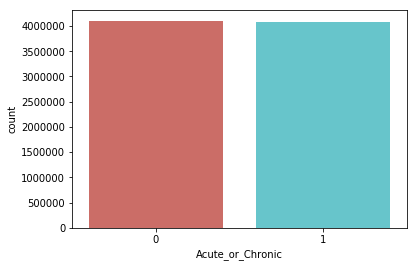


    <Figure size 432x288 with 0 Axes>


```python
df2.groupby('Acute_or_Chronic').mean()
```


<div>
<style scoped>
    .dataframe tbody tr th:only-of-type {
        vertical-align: middle;
    }

    .dataframe tbody tr th {
        vertical-align: top;
    }

    .dataframe thead th {
        text-align: right;
    }
</style>
<table border="1" class="dataframe">
  <thead>
    <tr style="text-align: right;">
      <th></th>
      <th>ITEMS</th>
      <th>NIC</th>
      <th>ACTCOST</th>
      <th>QUANTITY</th>
    </tr>
    <tr>
      <th>Acute_or_Chronic</th>
      <th></th>
      <th></th>
      <th></th>
      <th></th>
    </tr>
  </thead>
  <tbody>
    <tr>
      <th>0</th>
      <td>8.108113</td>
      <td>52.204348</td>
      <td>48.713056</td>
      <td>946.091538</td>
    </tr>
    <tr>
      <th>1</th>
      <td>12.840868</td>
      <td>80.585229</td>
      <td>75.289083</td>
      <td>665.557547</td>
    </tr>
  </tbody>
</table>
</div>


# An obsevation
In the plot above it appears to demonstrate that GPs have prescribed similar percentage of acute and chronic prescriptions. Yet in the deeper exploration of the perscription medication, there are more quantity of acute prescriptions. Additionally, for chronic prescription starts off from a higher number off items and with a higher number of NIC (net ingredient cost) and ACTCOST (actual cost in £ & ¢)


```python
df2.groupby('CITY').mean()
```


<div>
<style scoped>
    .dataframe tbody tr th:only-of-type {
        vertical-align: middle;
    }

    .dataframe tbody tr th {
        vertical-align: top;
    }

    .dataframe thead th {
        text-align: right;
    }
</style>
<table border="1" class="dataframe">
  <thead>
    <tr style="text-align: right;">
      <th></th>
      <th>ITEMS</th>
      <th>NIC</th>
      <th>ACTCOST</th>
      <th>QUANTITY</th>
      <th>Acute_or_Chronic</th>
    </tr>
    <tr>
      <th>CITY</th>
      <th></th>
      <th></th>
      <th></th>
      <th></th>
      <th></th>
    </tr>
  </thead>
  <tbody>
    <tr>
      <th></th>
      <td>8.218440</td>
      <td>52.041713</td>
      <td>48.766040</td>
      <td>705.308798</td>
      <td>0.488355</td>
    </tr>
    <tr>
      <th>SLOUGH</th>
      <td>16.379267</td>
      <td>83.336625</td>
      <td>78.135088</td>
      <td>1215.962705</td>
      <td>0.490518</td>
    </tr>
    <tr>
      <th>WRAGBY</th>
      <td>8.500969</td>
      <td>47.828944</td>
      <td>44.403382</td>
      <td>448.058624</td>
      <td>0.502907</td>
    </tr>
    <tr>
      <th>(OFF SOUTH HILL PARK)</th>
      <td>5.557377</td>
      <td>51.799918</td>
      <td>48.242857</td>
      <td>551.377635</td>
      <td>0.496487</td>
    </tr>
    <tr>
      <th>1 ALLEYN PARK</th>
      <td>11.155091</td>
      <td>84.951787</td>
      <td>79.400148</td>
      <td>985.575320</td>
      <td>0.480782</td>
    </tr>
    <tr>
      <th>1 BAILEY STREET</th>
      <td>11.797565</td>
      <td>79.675495</td>
      <td>74.326598</td>
      <td>908.565304</td>
      <td>0.505327</td>
    </tr>
    <tr>
      <th>1 ISLINGTON ST  SWINDON</th>
      <td>7.152557</td>
      <td>61.280838</td>
      <td>57.068924</td>
      <td>732.231041</td>
      <td>0.512346</td>
    </tr>
    <tr>
      <th>1 ST JAMES ROAD</th>
      <td>5.366197</td>
      <td>35.299296</td>
      <td>32.912739</td>
      <td>331.586854</td>
      <td>0.489828</td>
    </tr>
    <tr>
      <th>1 THE BROADWALK  SALFORD</th>
      <td>11.987730</td>
      <td>63.341679</td>
      <td>59.475061</td>
      <td>914.078681</td>
      <td>0.506902</td>
    </tr>
    <tr>
      <th>1 WORSALL ROAD</th>
      <td>13.403627</td>
      <td>83.517582</td>
      <td>77.889987</td>
      <td>917.222968</td>
      <td>0.474815</td>
    </tr>
    <tr>
      <th>1-3 RICE LANE  WALTON</th>
      <td>12.666667</td>
      <td>71.045272</td>
      <td>66.348475</td>
      <td>1074.184104</td>
      <td>0.517437</td>
    </tr>
    <tr>
      <th>1-31 ELKSTONE ROAD</th>
      <td>6.790488</td>
      <td>47.982031</td>
      <td>45.256864</td>
      <td>843.679306</td>
      <td>0.497429</td>
    </tr>
    <tr>
      <th>1-5 NEWINGTON CAUSEWAY</th>
      <td>5.473154</td>
      <td>30.052304</td>
      <td>28.187427</td>
      <td>447.715884</td>
      <td>0.517897</td>
    </tr>
    <tr>
      <th>11-13 WESTON STREET</th>
      <td>1.222222</td>
      <td>22.230000</td>
      <td>20.660000</td>
      <td>141.333333</td>
      <td>0.111111</td>
    </tr>
    <tr>
      <th>121 SWINDON RD CHELTENHAM</th>
      <td>11.321843</td>
      <td>69.008745</td>
      <td>64.601408</td>
      <td>598.854045</td>
      <td>0.504027</td>
    </tr>
    <tr>
      <th>133 LONDON ROAD  COWPLAIN</th>
      <td>6.038084</td>
      <td>49.747482</td>
      <td>46.289803</td>
      <td>602.882678</td>
      <td>0.496314</td>
    </tr>
    <tr>
      <th>135 HIGH STREET</th>
      <td>14.683041</td>
      <td>79.698298</td>
      <td>74.492018</td>
      <td>848.292398</td>
      <td>0.490058</td>
    </tr>
    <tr>
      <th>14 MORSTON CLOSE</th>
      <td>6.399361</td>
      <td>44.333845</td>
      <td>41.404665</td>
      <td>589.481267</td>
      <td>0.500532</td>
    </tr>
    <tr>
      <th>145 LONDON ROAD STANWAY</th>
      <td>8.754086</td>
      <td>57.961673</td>
      <td>54.082249</td>
      <td>759.791829</td>
      <td>0.518288</td>
    </tr>
    <tr>
      <th>151 WEDNESBURY RD WALSALL</th>
      <td>4.161648</td>
      <td>26.898035</td>
      <td>25.120903</td>
      <td>469.782884</td>
      <td>0.497623</td>
    </tr>
    <tr>
      <th>165 LANARK ROAD</th>
      <td>6.175764</td>
      <td>47.343013</td>
      <td>44.285142</td>
      <td>451.454694</td>
      <td>0.481441</td>
    </tr>
    <tr>
      <th>168 THE STREET  CAPEL</th>
      <td>11.107950</td>
      <td>58.440318</td>
      <td>54.288895</td>
      <td>604.640586</td>
      <td>0.487866</td>
    </tr>
    <tr>
      <th>169 GROVE LANE TIMPERLEY</th>
      <td>8.631380</td>
      <td>47.635255</td>
      <td>44.624707</td>
      <td>579.218809</td>
      <td>0.491493</td>
    </tr>
    <tr>
      <th>17 MOOREND PARK ROAD</th>
      <td>12.993361</td>
      <td>73.313112</td>
      <td>68.635137</td>
      <td>669.828216</td>
      <td>0.520332</td>
    </tr>
    <tr>
      <th>17-19 HAZELWOOD ROAD</th>
      <td>15.655296</td>
      <td>54.657110</td>
      <td>51.914659</td>
      <td>709.364901</td>
      <td>0.525135</td>
    </tr>
    <tr>
      <th>186 HOMERTON HIGH STREET</th>
      <td>6.208940</td>
      <td>48.841642</td>
      <td>45.477380</td>
      <td>702.046778</td>
      <td>0.486486</td>
    </tr>
    <tr>
      <th>19 WORDSWORTH AVENUE</th>
      <td>10.662930</td>
      <td>62.895925</td>
      <td>58.800136</td>
      <td>1028.841473</td>
      <td>0.489992</td>
    </tr>
    <tr>
      <th>2 DEN CRESCENT</th>
      <td>10.022450</td>
      <td>80.122963</td>
      <td>74.611809</td>
      <td>861.340667</td>
      <td>0.497755</td>
    </tr>
    <tr>
      <th>2 THE VILLAGE  WIGGINTON</th>
      <td>25.728358</td>
      <td>152.721957</td>
      <td>142.394516</td>
      <td>2032.015275</td>
      <td>0.462687</td>
    </tr>
    <tr>
      <th>20 BRIDGE LANE  BATTERSEA</th>
      <td>13.940205</td>
      <td>68.908600</td>
      <td>64.938065</td>
      <td>739.443745</td>
      <td>0.490165</td>
    </tr>
    <tr>
      <th>...</th>
      <td>...</td>
      <td>...</td>
      <td>...</td>
      <td>...</td>
      <td>...</td>
    </tr>
    <tr>
      <th>WOOTTON</th>
      <td>1.000000</td>
      <td>63.715000</td>
      <td>59.150000</td>
      <td>78.000000</td>
      <td>0.000000</td>
    </tr>
    <tr>
      <th>WOOTTON BASSETT</th>
      <td>12.003605</td>
      <td>68.189308</td>
      <td>63.857909</td>
      <td>718.165321</td>
      <td>0.477289</td>
    </tr>
    <tr>
      <th>WOOTTON GROVE</th>
      <td>9.224242</td>
      <td>48.831152</td>
      <td>45.459238</td>
      <td>499.810823</td>
      <td>0.511688</td>
    </tr>
    <tr>
      <th>WORCESTER</th>
      <td>10.481863</td>
      <td>71.888683</td>
      <td>67.083411</td>
      <td>694.094487</td>
      <td>0.484454</td>
    </tr>
    <tr>
      <th>WORCESTER PARK</th>
      <td>8.445355</td>
      <td>61.791699</td>
      <td>57.650624</td>
      <td>789.275232</td>
      <td>0.498179</td>
    </tr>
    <tr>
      <th>WORDSLEY</th>
      <td>1.714286</td>
      <td>5.025714</td>
      <td>4.685714</td>
      <td>259.285714</td>
      <td>0.285714</td>
    </tr>
    <tr>
      <th>WORKINGTON</th>
      <td>10.668264</td>
      <td>62.611991</td>
      <td>58.406972</td>
      <td>817.883543</td>
      <td>0.495345</td>
    </tr>
    <tr>
      <th>WORKSOP</th>
      <td>16.606470</td>
      <td>105.693061</td>
      <td>98.639906</td>
      <td>1288.582086</td>
      <td>0.481169</td>
    </tr>
    <tr>
      <th>WORSLEY</th>
      <td>10.065272</td>
      <td>55.994351</td>
      <td>52.580310</td>
      <td>680.889908</td>
      <td>0.489540</td>
    </tr>
    <tr>
      <th>WORTHEN  NR.SHREWSBURY</th>
      <td>6.234589</td>
      <td>34.038459</td>
      <td>31.600925</td>
      <td>357.408236</td>
      <td>0.515411</td>
    </tr>
    <tr>
      <th>WORTHING</th>
      <td>11.587626</td>
      <td>79.926532</td>
      <td>74.632070</td>
      <td>989.171918</td>
      <td>0.475121</td>
    </tr>
    <tr>
      <th>WOTTON-UNDER-EDGE</th>
      <td>9.728232</td>
      <td>54.379092</td>
      <td>50.652959</td>
      <td>502.125631</td>
      <td>0.473426</td>
    </tr>
    <tr>
      <th>WRAXALL</th>
      <td>1.100000</td>
      <td>64.266000</td>
      <td>59.673000</td>
      <td>82.000000</td>
      <td>0.500000</td>
    </tr>
    <tr>
      <th>WRECCLESHAM  FARNHAM</th>
      <td>7.739550</td>
      <td>44.150118</td>
      <td>41.078178</td>
      <td>397.427653</td>
      <td>0.502680</td>
    </tr>
    <tr>
      <th>WRENBURY</th>
      <td>7.741416</td>
      <td>39.066384</td>
      <td>36.291180</td>
      <td>473.692060</td>
      <td>0.507511</td>
    </tr>
    <tr>
      <th>WRINEHILL</th>
      <td>4.596358</td>
      <td>31.150303</td>
      <td>28.938756</td>
      <td>280.765554</td>
      <td>0.518968</td>
    </tr>
    <tr>
      <th>WYLAM</th>
      <td>11.204064</td>
      <td>58.757456</td>
      <td>54.880150</td>
      <td>733.396643</td>
      <td>0.503534</td>
    </tr>
    <tr>
      <th>WYMONDHAM</th>
      <td>6.751515</td>
      <td>43.275556</td>
      <td>40.271121</td>
      <td>474.827182</td>
      <td>0.514141</td>
    </tr>
    <tr>
      <th>WYTHENSHAWE</th>
      <td>7.774134</td>
      <td>50.876684</td>
      <td>47.577763</td>
      <td>770.185151</td>
      <td>0.518055</td>
    </tr>
    <tr>
      <th>YARDLEY</th>
      <td>11.217997</td>
      <td>71.344886</td>
      <td>66.501831</td>
      <td>922.404943</td>
      <td>0.489861</td>
    </tr>
    <tr>
      <th>YARDLEY WOOD</th>
      <td>8.919060</td>
      <td>71.597221</td>
      <td>66.689131</td>
      <td>1067.789966</td>
      <td>0.480045</td>
    </tr>
    <tr>
      <th>YARDLEY WOOD  BIRMINGHAM</th>
      <td>30.800000</td>
      <td>25.778000</td>
      <td>26.110000</td>
      <td>953.200000</td>
      <td>0.200000</td>
    </tr>
    <tr>
      <th>YATE</th>
      <td>9.810155</td>
      <td>75.761648</td>
      <td>70.634054</td>
      <td>757.159897</td>
      <td>0.486387</td>
    </tr>
    <tr>
      <th>YATE  BRISTOL</th>
      <td>1.000000</td>
      <td>5.395000</td>
      <td>5.070000</td>
      <td>127.500000</td>
      <td>0.500000</td>
    </tr>
    <tr>
      <th>YELVERTON</th>
      <td>10.067939</td>
      <td>71.396313</td>
      <td>66.603405</td>
      <td>731.180099</td>
      <td>0.475573</td>
    </tr>
    <tr>
      <th>YEOVIL</th>
      <td>10.228552</td>
      <td>65.896671</td>
      <td>61.435605</td>
      <td>816.424027</td>
      <td>0.513141</td>
    </tr>
    <tr>
      <th>YETMINSTER</th>
      <td>8.349340</td>
      <td>41.654850</td>
      <td>38.671477</td>
      <td>399.557023</td>
      <td>0.482593</td>
    </tr>
    <tr>
      <th>YIEWSLEY</th>
      <td>8.259105</td>
      <td>41.057992</td>
      <td>38.450801</td>
      <td>579.273153</td>
      <td>0.503642</td>
    </tr>
    <tr>
      <th>YORK</th>
      <td>12.893353</td>
      <td>85.851762</td>
      <td>80.016175</td>
      <td>1016.748733</td>
      <td>0.482234</td>
    </tr>
    <tr>
      <th>YORKLEY LYDNEY</th>
      <td>11.784841</td>
      <td>61.708117</td>
      <td>57.530302</td>
      <td>615.219641</td>
      <td>0.519152</td>
    </tr>
  </tbody>
</table>
<p>2407 rows × 5 columns</p>
</div>


```python
df2.groupby('POSTALCODE').mean()
```


<div>
<style scoped>
    .dataframe tbody tr th:only-of-type {
        vertical-align: middle;
    }

    .dataframe tbody tr th {
        vertical-align: top;
    }

    .dataframe thead th {
        text-align: right;
    }
</style>
<table border="1" class="dataframe">
  <thead>
    <tr style="text-align: right;">
      <th></th>
      <th>ITEMS</th>
      <th>NIC</th>
      <th>ACTCOST</th>
      <th>QUANTITY</th>
      <th>Acute_or_Chronic</th>
    </tr>
    <tr>
      <th>POSTALCODE</th>
      <th></th>
      <th></th>
      <th></th>
      <th></th>
      <th></th>
    </tr>
  </thead>
  <tbody>
    <tr>
      <th>AL1 3FY</th>
      <td>11.030349</td>
      <td>41.600941</td>
      <td>39.388574</td>
      <td>488.374810</td>
      <td>0.509863</td>
    </tr>
    <tr>
      <th>AL1 3HD</th>
      <td>12.044776</td>
      <td>88.925697</td>
      <td>83.149988</td>
      <td>1013.396144</td>
      <td>0.465174</td>
    </tr>
    <tr>
      <th>AL1 3JB</th>
      <td>12.243075</td>
      <td>83.093068</td>
      <td>77.768033</td>
      <td>860.342452</td>
      <td>0.488920</td>
    </tr>
    <tr>
      <th>AL10 0BS</th>
      <td>10.549886</td>
      <td>58.841203</td>
      <td>55.043839</td>
      <td>679.562452</td>
      <td>0.492765</td>
    </tr>
    <tr>
      <th>AL10 0LF</th>
      <td>1.477273</td>
      <td>55.414091</td>
      <td>51.436818</td>
      <td>61.954545</td>
      <td>0.068182</td>
    </tr>
    <tr>
      <th>AL10 0NL</th>
      <td>13.162215</td>
      <td>78.962117</td>
      <td>73.846450</td>
      <td>944.086645</td>
      <td>0.486645</td>
    </tr>
    <tr>
      <th>AL10 0UR</th>
      <td>105.153846</td>
      <td>1331.665385</td>
      <td>1260.264231</td>
      <td>40134.730769</td>
      <td>0.653846</td>
    </tr>
    <tr>
      <th>AL10 8HP</th>
      <td>10.538179</td>
      <td>62.875822</td>
      <td>58.780433</td>
      <td>720.357195</td>
      <td>0.492658</td>
    </tr>
    <tr>
      <th>AL2 1ES</th>
      <td>5.004000</td>
      <td>36.412187</td>
      <td>34.019507</td>
      <td>396.444000</td>
      <td>0.490667</td>
    </tr>
    <tr>
      <th>AL2 1EU</th>
      <td>9.096447</td>
      <td>62.597335</td>
      <td>58.530660</td>
      <td>839.223773</td>
      <td>0.484772</td>
    </tr>
    <tr>
      <th>AL2 3JX</th>
      <td>9.362932</td>
      <td>70.833073</td>
      <td>66.291959</td>
      <td>772.570825</td>
      <td>0.473573</td>
    </tr>
    <tr>
      <th>AL3 5HB</th>
      <td>9.571429</td>
      <td>64.687151</td>
      <td>60.503050</td>
      <td>616.626641</td>
      <td>0.470270</td>
    </tr>
    <tr>
      <th>AL3 5JB</th>
      <td>3.071429</td>
      <td>73.081429</td>
      <td>68.042143</td>
      <td>339.785714</td>
      <td>0.714286</td>
    </tr>
    <tr>
      <th>AL3 5NF</th>
      <td>9.325733</td>
      <td>63.889764</td>
      <td>59.823762</td>
      <td>749.679967</td>
      <td>0.478827</td>
    </tr>
    <tr>
      <th>AL3 5NP</th>
      <td>12.627864</td>
      <td>80.905542</td>
      <td>75.726960</td>
      <td>960.098762</td>
      <td>0.464396</td>
    </tr>
    <tr>
      <th>AL5 2BT</th>
      <td>10.860955</td>
      <td>81.527767</td>
      <td>76.145688</td>
      <td>924.457865</td>
      <td>0.475421</td>
    </tr>
    <tr>
      <th>AL5 4HX</th>
      <td>7.291396</td>
      <td>61.667159</td>
      <td>57.555406</td>
      <td>510.947646</td>
      <td>0.476461</td>
    </tr>
    <tr>
      <th>AL5 4QA</th>
      <td>8.979651</td>
      <td>76.136308</td>
      <td>71.011344</td>
      <td>770.089390</td>
      <td>0.468023</td>
    </tr>
    <tr>
      <th>AL6 9EF</th>
      <td>18.636651</td>
      <td>94.250295</td>
      <td>88.347272</td>
      <td>1132.652449</td>
      <td>0.479726</td>
    </tr>
    <tr>
      <th>AL6 9PW</th>
      <td>1.000000</td>
      <td>13.657500</td>
      <td>12.715000</td>
      <td>171.500000</td>
      <td>0.250000</td>
    </tr>
    <tr>
      <th>AL6 9SB</th>
      <td>3.417722</td>
      <td>95.367722</td>
      <td>88.589367</td>
      <td>468.949367</td>
      <td>0.227848</td>
    </tr>
    <tr>
      <th>AL7 1BW</th>
      <td>2.633588</td>
      <td>56.984103</td>
      <td>52.942576</td>
      <td>107.265267</td>
      <td>0.181298</td>
    </tr>
    <tr>
      <th>AL7 1JR</th>
      <td>1.000000</td>
      <td>7.586667</td>
      <td>7.086667</td>
      <td>100.333333</td>
      <td>0.000000</td>
    </tr>
    <tr>
      <th>AL7 3UJ</th>
      <td>19.755203</td>
      <td>110.677810</td>
      <td>103.511511</td>
      <td>1202.418979</td>
      <td>0.497027</td>
    </tr>
    <tr>
      <th>AL7 4HL</th>
      <td>7.036032</td>
      <td>39.459546</td>
      <td>36.861002</td>
      <td>426.227048</td>
      <td>0.416091</td>
    </tr>
    <tr>
      <th>AL7 4PL</th>
      <td>14.311872</td>
      <td>87.299427</td>
      <td>81.621146</td>
      <td>983.743355</td>
      <td>0.487891</td>
    </tr>
    <tr>
      <th>AL8 6JL</th>
      <td>4.000000</td>
      <td>72.598667</td>
      <td>67.440667</td>
      <td>49.833333</td>
      <td>0.033333</td>
    </tr>
    <tr>
      <th>AL8 7QG</th>
      <td>11.419728</td>
      <td>65.278014</td>
      <td>60.995204</td>
      <td>743.038374</td>
      <td>0.487755</td>
    </tr>
    <tr>
      <th>AL9 7SN</th>
      <td>9.222137</td>
      <td>54.892298</td>
      <td>51.253626</td>
      <td>558.498473</td>
      <td>0.498473</td>
    </tr>
    <tr>
      <th>B1 1EQ</th>
      <td>181.166667</td>
      <td>2617.049333</td>
      <td>2474.693000</td>
      <td>89785.033333</td>
      <td>0.600000</td>
    </tr>
    <tr>
      <th>...</th>
      <td>...</td>
      <td>...</td>
      <td>...</td>
      <td>...</td>
      <td>...</td>
    </tr>
    <tr>
      <th>YO24 3WX</th>
      <td>28.675345</td>
      <td>191.551444</td>
      <td>178.819673</td>
      <td>2428.637243</td>
      <td>0.457594</td>
    </tr>
    <tr>
      <th>YO24 4DB</th>
      <td>8.265233</td>
      <td>64.811613</td>
      <td>60.481649</td>
      <td>729.122312</td>
      <td>0.499104</td>
    </tr>
    <tr>
      <th>YO24 4HD</th>
      <td>22.465146</td>
      <td>151.728636</td>
      <td>141.447771</td>
      <td>1735.501166</td>
      <td>0.469019</td>
    </tr>
    <tr>
      <th>YO25 6EB</th>
      <td>17.408620</td>
      <td>105.904544</td>
      <td>98.616585</td>
      <td>1152.272231</td>
      <td>0.498636</td>
    </tr>
    <tr>
      <th>YO25 6UH</th>
      <td>12.860784</td>
      <td>74.506928</td>
      <td>69.328425</td>
      <td>835.833333</td>
      <td>0.486928</td>
    </tr>
    <tr>
      <th>YO26 8BN</th>
      <td>8.030247</td>
      <td>47.521540</td>
      <td>44.149478</td>
      <td>538.334097</td>
      <td>0.491292</td>
    </tr>
    <tr>
      <th>YO30 5PB</th>
      <td>4.776765</td>
      <td>19.637722</td>
      <td>18.391139</td>
      <td>232.258542</td>
      <td>0.273349</td>
    </tr>
    <tr>
      <th>YO31 7YD</th>
      <td>4.520906</td>
      <td>31.765505</td>
      <td>29.585732</td>
      <td>362.222997</td>
      <td>0.540070</td>
    </tr>
    <tr>
      <th>YO31 8HE</th>
      <td>1.438202</td>
      <td>36.411236</td>
      <td>33.810449</td>
      <td>76.157303</td>
      <td>0.247191</td>
    </tr>
    <tr>
      <th>YO32 2LL</th>
      <td>25.728358</td>
      <td>152.721957</td>
      <td>142.394516</td>
      <td>2032.015275</td>
      <td>0.462687</td>
    </tr>
    <tr>
      <th>YO32 5UA</th>
      <td>15.885563</td>
      <td>96.496819</td>
      <td>89.852782</td>
      <td>1095.726232</td>
      <td>0.486502</td>
    </tr>
    <tr>
      <th>YO41 4DY</th>
      <td>10.582152</td>
      <td>56.733394</td>
      <td>52.689283</td>
      <td>681.788499</td>
      <td>0.502085</td>
    </tr>
    <tr>
      <th>YO42 2BS</th>
      <td>15.759009</td>
      <td>95.723649</td>
      <td>89.104443</td>
      <td>1126.810529</td>
      <td>0.483108</td>
    </tr>
    <tr>
      <th>YO43 3FF</th>
      <td>11.822119</td>
      <td>73.009980</td>
      <td>68.080273</td>
      <td>890.639574</td>
      <td>0.505663</td>
    </tr>
    <tr>
      <th>YO51 9BD</th>
      <td>12.852448</td>
      <td>75.009510</td>
      <td>69.748371</td>
      <td>899.101049</td>
      <td>0.493007</td>
    </tr>
    <tr>
      <th>YO60 6PS</th>
      <td>4.691992</td>
      <td>23.990164</td>
      <td>22.296838</td>
      <td>282.039014</td>
      <td>0.515400</td>
    </tr>
    <tr>
      <th>YO61 1LL</th>
      <td>7.057457</td>
      <td>37.518313</td>
      <td>34.856883</td>
      <td>402.906479</td>
      <td>0.526895</td>
    </tr>
    <tr>
      <th>YO61 1QW</th>
      <td>6.208766</td>
      <td>36.317336</td>
      <td>33.741638</td>
      <td>430.230104</td>
      <td>0.497116</td>
    </tr>
    <tr>
      <th>YO61 3JR</th>
      <td>9.839342</td>
      <td>64.700455</td>
      <td>60.207876</td>
      <td>740.077586</td>
      <td>0.492947</td>
    </tr>
    <tr>
      <th>YO62 4EF</th>
      <td>7.508386</td>
      <td>35.806625</td>
      <td>33.259738</td>
      <td>377.729665</td>
      <td>0.485325</td>
    </tr>
    <tr>
      <th>YO62 5HD</th>
      <td>9.515882</td>
      <td>36.236188</td>
      <td>33.991227</td>
      <td>446.159715</td>
      <td>0.510405</td>
    </tr>
    <tr>
      <th>YO62 6AR</th>
      <td>9.030669</td>
      <td>52.826914</td>
      <td>49.220288</td>
      <td>574.676580</td>
      <td>0.508364</td>
    </tr>
    <tr>
      <th>YO7 1LG</th>
      <td>10.681926</td>
      <td>59.830568</td>
      <td>55.673362</td>
      <td>668.249408</td>
      <td>0.460931</td>
    </tr>
    <tr>
      <th>YO7 1LU</th>
      <td>11.279913</td>
      <td>67.457157</td>
      <td>62.798666</td>
      <td>686.707759</td>
      <td>0.470631</td>
    </tr>
    <tr>
      <th>YO7 3RP</th>
      <td>5.992504</td>
      <td>34.249100</td>
      <td>31.810990</td>
      <td>326.137181</td>
      <td>0.505247</td>
    </tr>
    <tr>
      <th>YO8 4BL</th>
      <td>8.217969</td>
      <td>73.426695</td>
      <td>68.348430</td>
      <td>853.667969</td>
      <td>0.491406</td>
    </tr>
    <tr>
      <th>YO8 4ET</th>
      <td>24.090909</td>
      <td>177.155455</td>
      <td>168.236364</td>
      <td>10033.909091</td>
      <td>0.818182</td>
    </tr>
    <tr>
      <th>YO8 4QH</th>
      <td>13.985679</td>
      <td>105.678842</td>
      <td>98.523910</td>
      <td>1149.238792</td>
      <td>0.485056</td>
    </tr>
    <tr>
      <th>YO8 9AJ</th>
      <td>17.431065</td>
      <td>103.387452</td>
      <td>96.480558</td>
      <td>1268.155032</td>
      <td>0.492728</td>
    </tr>
    <tr>
      <th>YO8 9BX</th>
      <td>2.280000</td>
      <td>8.744400</td>
      <td>8.187200</td>
      <td>73.960000</td>
      <td>0.200000</td>
    </tr>
  </tbody>
</table>
<p>7385 rows × 5 columns</p>
</div>


```python
df2.groupby('PRACTICE').mean()
```


<div>
<style scoped>
    .dataframe tbody tr th:only-of-type {
        vertical-align: middle;
    }

    .dataframe tbody tr th {
        vertical-align: top;
    }

    .dataframe thead th {
        text-align: right;
    }
</style>
<table border="1" class="dataframe">
  <thead>
    <tr style="text-align: right;">
      <th></th>
      <th>ITEMS</th>
      <th>NIC</th>
      <th>ACTCOST</th>
      <th>QUANTITY</th>
      <th>Acute_or_Chronic</th>
    </tr>
    <tr>
      <th>PRACTICE</th>
      <th></th>
      <th></th>
      <th></th>
      <th></th>
      <th></th>
    </tr>
  </thead>
  <tbody>
    <tr>
      <th>A81001</th>
      <td>7.591143</td>
      <td>44.392853</td>
      <td>41.498733</td>
      <td>549.781153</td>
      <td>0.523172</td>
    </tr>
    <tr>
      <th>A81002</th>
      <td>20.813914</td>
      <td>133.932511</td>
      <td>124.950153</td>
      <td>1499.244061</td>
      <td>0.477941</td>
    </tr>
    <tr>
      <th>A81004</th>
      <td>12.646690</td>
      <td>81.225268</td>
      <td>75.822467</td>
      <td>1000.408711</td>
      <td>0.481533</td>
    </tr>
    <tr>
      <th>A81005</th>
      <td>12.319739</td>
      <td>61.008491</td>
      <td>57.102129</td>
      <td>746.754078</td>
      <td>0.505710</td>
    </tr>
    <tr>
      <th>A81006</th>
      <td>17.764784</td>
      <td>104.314551</td>
      <td>97.347402</td>
      <td>1194.946140</td>
      <td>0.505648</td>
    </tr>
    <tr>
      <th>A81007</th>
      <td>12.731125</td>
      <td>84.221749</td>
      <td>78.629445</td>
      <td>929.738059</td>
      <td>0.493837</td>
    </tr>
    <tr>
      <th>A81009</th>
      <td>11.659738</td>
      <td>67.452864</td>
      <td>62.979915</td>
      <td>820.707467</td>
      <td>0.491147</td>
    </tr>
    <tr>
      <th>A81011</th>
      <td>16.328550</td>
      <td>103.178187</td>
      <td>96.396299</td>
      <td>1334.138595</td>
      <td>0.510574</td>
    </tr>
    <tr>
      <th>A81012</th>
      <td>11.967033</td>
      <td>58.600018</td>
      <td>54.959304</td>
      <td>901.558608</td>
      <td>0.500916</td>
    </tr>
    <tr>
      <th>A81013</th>
      <td>11.223794</td>
      <td>57.553594</td>
      <td>53.748361</td>
      <td>657.207571</td>
      <td>0.502496</td>
    </tr>
    <tr>
      <th>A81014</th>
      <td>7.946050</td>
      <td>49.342948</td>
      <td>46.076850</td>
      <td>470.010597</td>
      <td>0.515414</td>
    </tr>
    <tr>
      <th>A81016</th>
      <td>12.499634</td>
      <td>69.602916</td>
      <td>65.066637</td>
      <td>918.498535</td>
      <td>0.492308</td>
    </tr>
    <tr>
      <th>A81017</th>
      <td>17.621185</td>
      <td>99.623477</td>
      <td>93.115362</td>
      <td>1175.639138</td>
      <td>0.497307</td>
    </tr>
    <tr>
      <th>A81018</th>
      <td>15.371884</td>
      <td>83.657507</td>
      <td>78.274834</td>
      <td>940.728186</td>
      <td>0.497230</td>
    </tr>
    <tr>
      <th>A81019</th>
      <td>13.759793</td>
      <td>84.341183</td>
      <td>78.758256</td>
      <td>1049.842942</td>
      <td>0.499630</td>
    </tr>
    <tr>
      <th>A81020</th>
      <td>11.695041</td>
      <td>67.979282</td>
      <td>63.549778</td>
      <td>806.052184</td>
      <td>0.491488</td>
    </tr>
    <tr>
      <th>A81021</th>
      <td>19.854271</td>
      <td>102.933034</td>
      <td>96.383524</td>
      <td>1199.004083</td>
      <td>0.485553</td>
    </tr>
    <tr>
      <th>A81022</th>
      <td>13.504437</td>
      <td>79.488123</td>
      <td>74.171693</td>
      <td>862.658976</td>
      <td>0.498976</td>
    </tr>
    <tr>
      <th>A81023</th>
      <td>7.422170</td>
      <td>58.493530</td>
      <td>54.563491</td>
      <td>687.807783</td>
      <td>0.467767</td>
    </tr>
    <tr>
      <th>A81025</th>
      <td>7.945745</td>
      <td>43.679436</td>
      <td>40.872596</td>
      <td>555.079255</td>
      <td>0.520213</td>
    </tr>
    <tr>
      <th>A81026</th>
      <td>17.510169</td>
      <td>109.966169</td>
      <td>102.698989</td>
      <td>1459.712429</td>
      <td>0.469492</td>
    </tr>
    <tr>
      <th>A81027</th>
      <td>13.403627</td>
      <td>83.517582</td>
      <td>77.889987</td>
      <td>917.222968</td>
      <td>0.474815</td>
    </tr>
    <tr>
      <th>A81029</th>
      <td>12.548012</td>
      <td>59.407333</td>
      <td>55.822270</td>
      <td>766.119787</td>
      <td>0.530553</td>
    </tr>
    <tr>
      <th>A81030</th>
      <td>13.076579</td>
      <td>95.830396</td>
      <td>89.496369</td>
      <td>1157.862476</td>
      <td>0.458839</td>
    </tr>
    <tr>
      <th>A81031</th>
      <td>14.233062</td>
      <td>103.780088</td>
      <td>96.833503</td>
      <td>1204.016938</td>
      <td>0.487805</td>
    </tr>
    <tr>
      <th>A81032</th>
      <td>14.032131</td>
      <td>78.867233</td>
      <td>73.599679</td>
      <td>1009.516066</td>
      <td>0.481311</td>
    </tr>
    <tr>
      <th>A81034</th>
      <td>19.596891</td>
      <td>125.786180</td>
      <td>117.344192</td>
      <td>1595.150194</td>
      <td>0.473071</td>
    </tr>
    <tr>
      <th>A81035</th>
      <td>11.946004</td>
      <td>82.094168</td>
      <td>76.604564</td>
      <td>1057.100432</td>
      <td>0.480202</td>
    </tr>
    <tr>
      <th>A81036</th>
      <td>18.347263</td>
      <td>108.109841</td>
      <td>100.985415</td>
      <td>1344.468511</td>
      <td>0.478517</td>
    </tr>
    <tr>
      <th>A81037</th>
      <td>11.528462</td>
      <td>68.799448</td>
      <td>64.397162</td>
      <td>841.659728</td>
      <td>0.514019</td>
    </tr>
    <tr>
      <th>...</th>
      <td>...</td>
      <td>...</td>
      <td>...</td>
      <td>...</td>
      <td>...</td>
    </tr>
    <tr>
      <th>Y06052</th>
      <td>5.463415</td>
      <td>17.442857</td>
      <td>16.387631</td>
      <td>220.132404</td>
      <td>0.341463</td>
    </tr>
    <tr>
      <th>Y06053</th>
      <td>66.375000</td>
      <td>671.375000</td>
      <td>637.498750</td>
      <td>27114.125000</td>
      <td>0.875000</td>
    </tr>
    <tr>
      <th>Y06054</th>
      <td>54.571429</td>
      <td>575.842857</td>
      <td>543.640000</td>
      <td>21914.428571</td>
      <td>1.000000</td>
    </tr>
    <tr>
      <th>Y06055</th>
      <td>25.250000</td>
      <td>205.597500</td>
      <td>195.522500</td>
      <td>12693.375000</td>
      <td>0.875000</td>
    </tr>
    <tr>
      <th>Y06056</th>
      <td>2.050000</td>
      <td>15.131062</td>
      <td>14.151687</td>
      <td>435.368750</td>
      <td>0.568750</td>
    </tr>
    <tr>
      <th>Y06058</th>
      <td>42.000000</td>
      <td>442.957500</td>
      <td>420.795500</td>
      <td>18368.650000</td>
      <td>0.450000</td>
    </tr>
    <tr>
      <th>Y06059</th>
      <td>68.038462</td>
      <td>948.899231</td>
      <td>894.790000</td>
      <td>33498.884615</td>
      <td>0.576923</td>
    </tr>
    <tr>
      <th>Y06061</th>
      <td>103.142857</td>
      <td>1257.428571</td>
      <td>1184.874286</td>
      <td>58602.571429</td>
      <td>0.714286</td>
    </tr>
    <tr>
      <th>Y06063</th>
      <td>2.313433</td>
      <td>28.622836</td>
      <td>26.612687</td>
      <td>355.409104</td>
      <td>0.179104</td>
    </tr>
    <tr>
      <th>Y06067</th>
      <td>1.166667</td>
      <td>65.348333</td>
      <td>60.766667</td>
      <td>124.166667</td>
      <td>0.833333</td>
    </tr>
    <tr>
      <th>Y06071</th>
      <td>4.218623</td>
      <td>74.361984</td>
      <td>69.047490</td>
      <td>96.036437</td>
      <td>0.137652</td>
    </tr>
    <tr>
      <th>Y06072</th>
      <td>1.222222</td>
      <td>27.693889</td>
      <td>25.720556</td>
      <td>9.000000</td>
      <td>0.000000</td>
    </tr>
    <tr>
      <th>Y06073</th>
      <td>47.555556</td>
      <td>442.942222</td>
      <td>421.487778</td>
      <td>17758.777778</td>
      <td>0.777778</td>
    </tr>
    <tr>
      <th>Y06076</th>
      <td>86.052632</td>
      <td>1190.926316</td>
      <td>1126.112632</td>
      <td>37397.000000</td>
      <td>0.789474</td>
    </tr>
    <tr>
      <th>Y06077</th>
      <td>4.843260</td>
      <td>17.952978</td>
      <td>16.850470</td>
      <td>247.448276</td>
      <td>0.329154</td>
    </tr>
    <tr>
      <th>Y06079</th>
      <td>1.000000</td>
      <td>1.520000</td>
      <td>1.446250</td>
      <td>16.625000</td>
      <td>0.250000</td>
    </tr>
    <tr>
      <th>Y06080</th>
      <td>2.454545</td>
      <td>10.684545</td>
      <td>10.170909</td>
      <td>192.318182</td>
      <td>0.636364</td>
    </tr>
    <tr>
      <th>Y06095</th>
      <td>1.380952</td>
      <td>6.943333</td>
      <td>6.544524</td>
      <td>351.047619</td>
      <td>0.738095</td>
    </tr>
    <tr>
      <th>Y06097</th>
      <td>1.100000</td>
      <td>9.905500</td>
      <td>9.217500</td>
      <td>16.225000</td>
      <td>0.000000</td>
    </tr>
    <tr>
      <th>Y06098</th>
      <td>1.000000</td>
      <td>0.840000</td>
      <td>0.890000</td>
      <td>28.000000</td>
      <td>1.000000</td>
    </tr>
    <tr>
      <th>Y06099</th>
      <td>1.250000</td>
      <td>17.565000</td>
      <td>16.320000</td>
      <td>159.750000</td>
      <td>0.000000</td>
    </tr>
    <tr>
      <th>Y06100</th>
      <td>1.553191</td>
      <td>3.830638</td>
      <td>3.595532</td>
      <td>56.276596</td>
      <td>0.191489</td>
    </tr>
    <tr>
      <th>Y06103</th>
      <td>1.000000</td>
      <td>9.070000</td>
      <td>8.530000</td>
      <td>56.000000</td>
      <td>1.000000</td>
    </tr>
    <tr>
      <th>Y06107</th>
      <td>1.000000</td>
      <td>7.042000</td>
      <td>6.630000</td>
      <td>66.800000</td>
      <td>0.200000</td>
    </tr>
    <tr>
      <th>Y06110</th>
      <td>1.277778</td>
      <td>3.325556</td>
      <td>3.141667</td>
      <td>61.111111</td>
      <td>0.333333</td>
    </tr>
    <tr>
      <th>Y06113</th>
      <td>4.615942</td>
      <td>31.218140</td>
      <td>29.146957</td>
      <td>1036.591787</td>
      <td>0.521739</td>
    </tr>
    <tr>
      <th>Y06120</th>
      <td>1.000000</td>
      <td>5.233571</td>
      <td>4.892143</td>
      <td>63.071429</td>
      <td>0.428571</td>
    </tr>
    <tr>
      <th>Y06121</th>
      <td>1.416667</td>
      <td>2.679167</td>
      <td>2.521667</td>
      <td>54.000000</td>
      <td>0.250000</td>
    </tr>
    <tr>
      <th>Y06128</th>
      <td>1.250000</td>
      <td>2.503333</td>
      <td>2.372500</td>
      <td>31.500000</td>
      <td>0.416667</td>
    </tr>
    <tr>
      <th>Y06131</th>
      <td>1.948718</td>
      <td>28.911111</td>
      <td>26.917436</td>
      <td>168.316239</td>
      <td>0.547009</td>
    </tr>
  </tbody>
</table>
<p>9140 rows × 5 columns</p>
</div>


```python
# Plotting 
```


```python
%matplotlib inline
pd.crosstab(df2.PRACTICE,df2.Acute_or_Chronic).plot(kind='bar')
plt.title('GP Prescription by Practice')
plt.xlabel('Practice')
plt.ylabel('Frequency of prescription')
#plt.savefig('frequency_medication')
```


    Text(0, 0.5, 'Frequency of prescription')


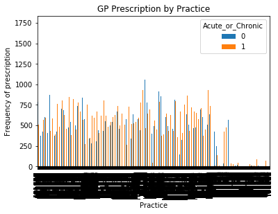


```python
table=pd.crosstab(df2.CITY,df2.Acute_or_Chronic)
table.div(table.sum(1).astype(float), axis=0).plot(kind='bar', stacked=True)
plt.title('Practice City vs Acute or Chronic')
plt.xlabel('City')
plt.ylabel('Perscribed Medication')
#plt.savefig('City vs Acute or Chronic')
```


    Text(0, 0.5, 'Perscribed Medication')


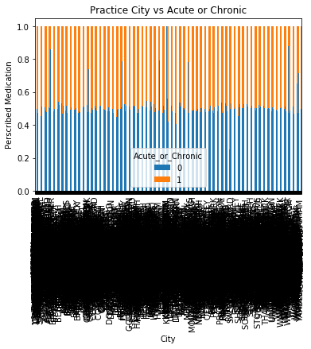


# Seaborn Countplot


```python
import numpy as np
import pandas as pd
from os import path
import re
import matplotlib.pyplot as plt
import seaborn as sns
```


```python
len(df2.PRACTICEFULLNAME)
```


    8173814


```python
practicename = df2.PRACTICEFULLNAME
```


```python
practice_counts = practicename.value_counts()
```


```python
practice_counts_df = pd.DataFrame({'col':practice_counts})
practice_counts_df = practice_counts_df.sort_values('col', ascending=False)
# Editing the column headers
practice_counts_df.columns = ['Frequency']
practice_counts_df.head()
```


<div>
<style scoped>
    .dataframe tbody tr th:only-of-type {
        vertical-align: middle;
    }

    .dataframe tbody tr th {
        vertical-align: top;
    }

    .dataframe thead th {
        text-align: right;
    }
</style>
<table border="1" class="dataframe">
  <thead>
    <tr style="text-align: right;">
      <th></th>
      <th>Frequency</th>
    </tr>
  </thead>
  <tbody>
    <tr>
      <th>PARK SURGERY</th>
      <td>9638</td>
    </tr>
    <tr>
      <th>HIGH STREET SURGERY</th>
      <td>9470</td>
    </tr>
    <tr>
      <th>TRINITY MEDICAL CENTRE</th>
      <td>8658</td>
    </tr>
    <tr>
      <th>VILLAGE SURGERY</th>
      <td>8519</td>
    </tr>
    <tr>
      <th>THE LIMES MEDICAL CENTRE</th>
      <td>7772</td>
    </tr>
  </tbody>
</table>
</div>


```python
sns.countplot(x='Frequency', data=practice_counts_df, palette='hls')
plt.show()
# plt.savefig('Practice Frequency plot')
```


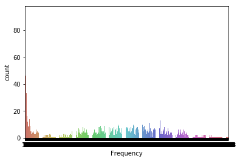


```python
sns.countplot(x='Frequency', data=practice_counts_df, palette='hls')
plt.xscale('log')
plt.show()
```


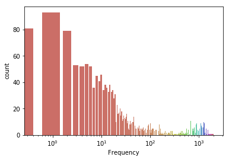


# Sklearn


```python
import pandas as pd
import numpy as np
from scipy import stats
from datetime import datetime
from sklearn import preprocessing
from sklearn.model_selection import KFold
from sklearn.linear_model import LinearRegression
import matplotlib.pyplot as plt
%matplotlib inline
```


```python
df2.shape #the data contains 8173814 rows and 13 columns.
```


    (8173814, 13)


```python
plt.scatter(df2['ACTCOST'], df2['QUANTITY'])
```


    <matplotlib.collections.PathCollection at 0xa76599f98>


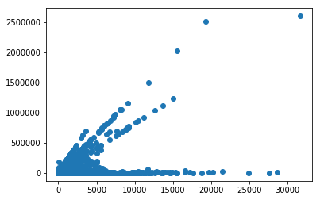


```python
plt.scatter(df2['ACTCOST'], df2['NIC'])
```


    <matplotlib.collections.PathCollection at 0xa79526cf8>


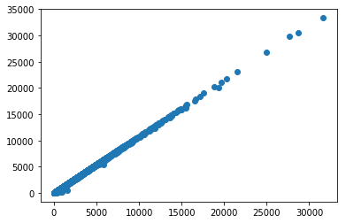


```python
plt.scatter(df2['ACTCOST'], df2['ITEMS'])
```


    <matplotlib.collections.PathCollection at 0xa7960b780>


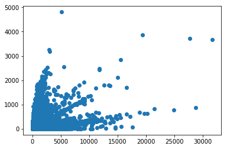


```python
plt.scatter(df2['NIC'], df2['ITEMS'])
```


    <matplotlib.collections.PathCollection at 0xa796766d8>


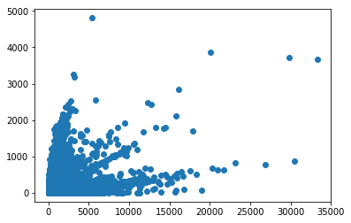


```python
plt.scatter(df2['NIC'], df2['QUANTITY'])
```


    <matplotlib.collections.PathCollection at 0xa79759828>


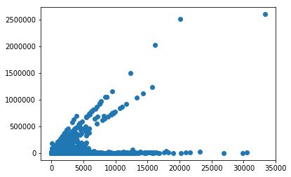

SHA1	SHA or AT code - 3 characters
PCT2	PCT or CCG code - 3 characters
PRACTICE	ANNNNN Practice code - 6 characters
BNF CODE	British National Formulary (BNF) code - 15 characters
BNF NAME	BNF presentation name - 40 characters
ITEMS	Prescription items dispensed - whole numbers
NIC	Net ingredient cost - pounds and pence
ACT COST	Actual cost - pounds and pence
QUANTITY	Quantity - whole numbers
PERIOD	YYYYMM
# An obsevation
The plots above demonstrates that the data is heavily skewed in one direction, with clear exception of ACTCOST and NIC. As the ACTCOST is the acutal cost in pounds and pence (£ and ¢) and the NIC is the net ingredient cost. However, in the remainder of the plots do not illustrate to have a higher percentage of confidence in the correlation coefficient as the outputs are monotonic relationship.

As a result, I have decided to no longer pursue the linear regression with the NHS data. Rather, I will be running a logistic regression. 

# Logistic Regression


```python
import numpy as np
import pandas as pd
import matplotlib.pyplot as plt
import seaborn as sns
%matplotlib inline
```


```python
df2.info()
```

    <class 'pandas.core.frame.DataFrame'>
    Int64Index: 8173814 entries, 0 to 8173813
    Data columns (total 13 columns):
    PRACTICE            object
    BNFCODE             object
    BNFNAME             object
    ITEMS               int64
    NIC                 float64
    ACTCOST             float64
    QUANTITY            float64
    PRACTICEFULLNAME    object
    STNAME              object
    CITY                object
    COUNTY              object
    POSTALCODE          object
    Acute_or_Chronic    int64
    dtypes: float64(3), int64(2), object(8)
    memory usage: 873.1+ MB


```python
del df2['PRACTICE']
del df2['BNFCODE']
del df2['BNFNAME'] 
del df2['PRACTICEFULLNAME']
del df2['STNAME']
del df2['CITY']
del df2['COUNTY']
del df2['POSTALCODE']
```


```python
#split dataset in features and target variable
feature_cols = ['ITEMS', 'NIC', 'ACTCOST','QUANTITY']
X = df2[feature_cols] # Features
y = df2.Acute_or_Chronic # Target variable
```


```python
# split X and y into training and testing sets
from sklearn.model_selection import train_test_split
# splitting the 75% for training and 25% for testing
X_train,X_test,y_train,y_test=train_test_split(X,y,test_size=0.25,random_state=0)
```


```python
# importing the logistic regression
from sklearn.linear_model import LogisticRegression
# instantiating the model
logreg = LogisticRegression()
# fitting the model with data
logreg.fit(X_train,y_train)
# predication
y_pred=logreg.predict(X_test)
```

    /Users/wuonseokchoi/anaconda3/lib/python3.7/site-packages/sklearn/linear_model/logistic.py:433: FutureWarning: Default solver will be changed to 'lbfgs' in 0.22. Specify a solver to silence this warning.
      FutureWarning)


```python
# import the metrics
from sklearn import metrics
confusion_matrix = metrics.confusion_matrix(y_test, y_pred)
confusion_matrix
```


    array([[827907, 197373],
           [673652, 344522]])


```python
# import the modules for visualisation
import numpy as np
import matplotlib.pyplot as plt
import seaborn as sns
%matplotlib inline
```


```python
class_names=[0,1] # name  of classes
fig, ax = plt.subplots()
tick_marks = np.arange(len(class_names))
plt.xticks(tick_marks, class_names)
plt.yticks(tick_marks, class_names)
# Creating heatmap
sns.heatmap(pd.DataFrame(confusion_matrix), annot=True, cmap="YlGnBu" ,fmt='g')
ax.xaxis.set_label_position("top")
plt.tight_layout()
plt.title('Confusion matrix', y=1.1)
plt.ylabel('Actual label')
plt.xlabel('Predicted label')
```


    Text(0.5, 257.44, 'Predicted label')


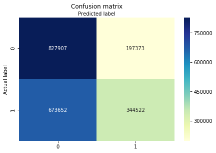


```python
# printing out model evaluation metrics
print("Accuracy:",metrics.accuracy_score(y_test, y_pred))
print("Precision:",metrics.precision_score(y_test, y_pred))
print("Recall:",metrics.recall_score(y_test, y_pred))
```

    Accuracy: 0.5737486628032733
    Precision: 0.6357726127755376
    Recall: 0.33837241964536513


```python
# ROC Curve (Receiver Operating Characteristic)
y_pred_proba = logreg.predict_proba(X_test)[::,1]
fpr, tpr, _ = metrics.roc_curve(y_test,  y_pred_proba)
auc = metrics.roc_auc_score(y_test, y_pred_proba)
plt.plot(fpr,tpr,label="data 1, auc="+str(auc))
plt.legend(loc=4)
plt.show()
```


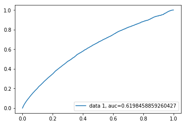


```python
print("The ROC Curve of this model is", auc)
```

    The ROC Curve of this model is 0.6198458859260427

